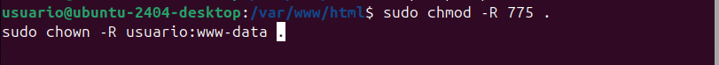

# Configuración cloud

## Subida de archivos 

Primero de todo buscamos el icono "+"

Vamos donde pone subidas.

Seleccionamos el archivo que queremos subir.

Ya tendriamos nuestro archivo subido.

## Creación de carpetas

Volvemos a ir al icono del "+".

Aqui deberemos fijarnos en la opción que pone "folder".

Seguidamente nos saldra para crear nuesta carpeta, ponemos el nombre de la carpeta y le damos a crear.

Finalmente ya la tendremos creada.

## Compartir contenido

Para compartir contenido deberemos hacer clic en la carpeta que queremos compartir como sale en la imagen.

Seguidamente tenemos dos opciónes compartir con grupos o compartir con un link público.

## Creación de usuarios

Para crear los usuarios deberemos ir a la esquina superior derecha.

Alli nos abrira un panel donde nos debemos fijar en la pestaña que pone "Users".

Después de entrar en users, en el centro del panel sale unas indicaciones que deberemos rellenar y hacer clic en "create user".

Finalmente tendremos creados todos los usuarios que queramos.

## Assignación de roles y permisos 

Primero de todo empezaremos asignando roles, para ello deberemos crear primero los grupos en los que queremos añadir a nuestros usuarios, es decir, nuestros roles.

Para ello primero iremos a la esquina superior izquierda donde pone grupos.

Allí elegiremos el nombre de nuestro rol.

Y finalmente lo crearemos.

Para cambiar de rol a cada uno de los usuarios nos vamos a ellos y en la pestaña donde pone admin hacemos clic y los cambiamos.

Ahora para dar permisos a cada uno de ellos en documentos 

Vamos a la pagina principal donde tenemos todo lo nuestro.

Seguidamente hacemos lo mismo que si fueramos a compartir el documento o la carpeta.

Nos vamos a la parte del sharing

Cuando ya estemos allí hacemos clic en la parte de "users and groups".

Allí añadimos los roles previamente creados.

Despues de añadir el rol hacemos clic en la rueda que hay y se nos desplegara un panel.

Ahi podremos elegir nuestros permisos para cada rol.

Al editor, le he puesto que pueda gestionar el documento, pero que no pueda borrar ni crear y al visualizador, le he quitado todos los permisos para que solo pueda ver.

## Organizar archivos y carpetas 

Owncloud tiene diferentes metodos de organización.

Yo he encontrado:

  - Como mover archivos
  - Como poner en favoritos
  - Camviar el nombre para separarlos por orden alfabetico

### Mover archivos

Primero deberemos poner el raton en el archivo que queremos mover.

Seguidamente arrastramos con el clic derecho presionado hacia la carpeta donde lo queremos guardar. Así deberia quedar.

### Poner en favoritos

Para poner en favoritos es muy sencillo, nos colocamos encima del archivo que queremos poner en favoritos.

Cuando hagamos eso a la izquierda del documento o carpeta saldra una estrella.

hacemos clic en la estrella y ya podremos ver esos archivos o carpetas en la sección de favoritos del panel izquierdo.

### Cambiar nombre para ordenar de manera alfabética

Vamos a nuestros archivos

Hacemos clic en los tres puntos que tiene cada uno de nuestros archivos.

Ahora nos saldra un panel, deberemos fijarnos en el botón que pone "rename".

Ahi cambiamos el nombre de manera que nos canvenga, teniendo en cuenta que ordenar de manera alfabetica.

## Políticas de seguridad

Para configurar las políticas de seguridad deberemos ir otra vez a la esquina superior derecha.

Ahora nos vamos a el btón de "preferencias"

Aqui se nos abrirá un panel, dberemos irnos a "Sharing".

Se nos abrirá este panel.

Aqui elegimos lo que nos venga mejor, yo pondre que se establezca una fecha de caducidad para las comparticionesde grupo y usuarios, voy a quitar que acepte automaticamente los nuevos compartidos de usuarios y también añadire una restricción a los usuarios para que solo puedan compartir con los grupos en los cuales són miembros.

## Configurar el accéso desde otra maquina 

Para que se pueda hacceder desde otra maquina primero deberemos saber la IP local 

Seguidmanete tendremos que saber si apache2 esta encendido

Ahora entramos en archivo donde esta la configuración y los dominions.

Donde pone "trusted_domains" añadimos una linea debajo de 0 => 'localhost' y ponemos la IP local, guardamos y cerramos.

Ahora ya deberia funcionar desde una maquina de la misma red.

