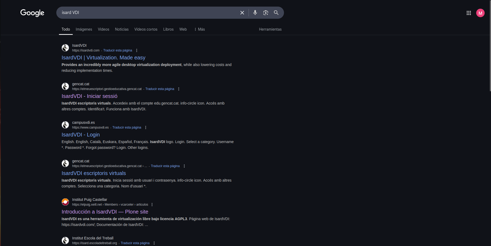
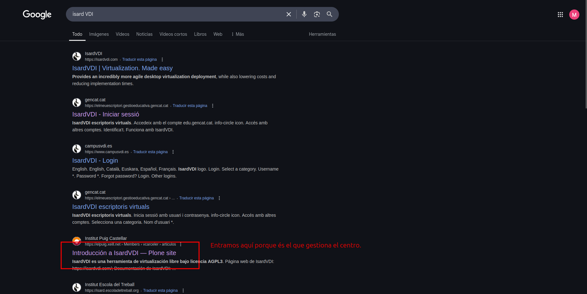
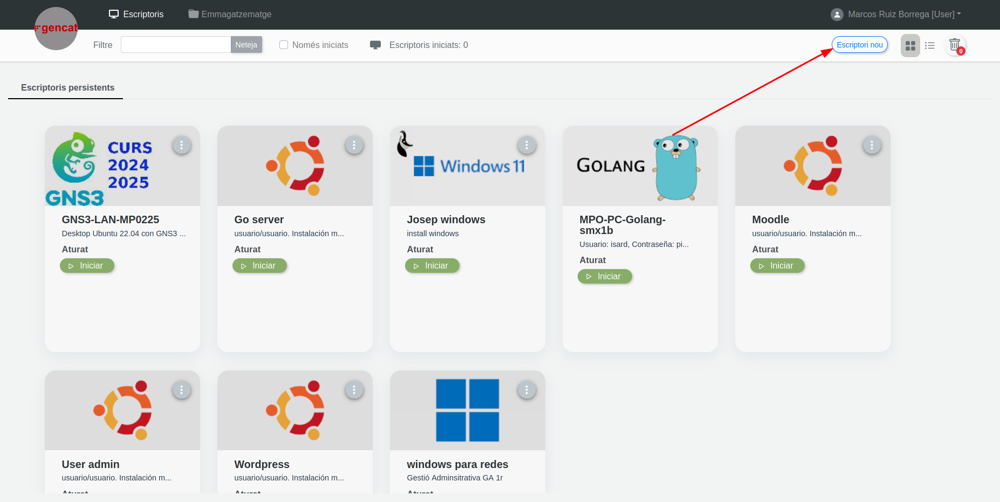

# Isard VDI
Para comenzar la instalación utilizaremos una maquina virtual llamada Isard VDI.

Primero buscamos el sitio web en internet o en nuestro navegador.

Entramos en el link marcado.

Iniciamos sesión con nuestro Usuario y contraseña 

Creamos un escritorio nuevo.

Seleccionamos el Ubuntu desktop y ponemos nombre a nuestro escritorio.

Al tener nuestro escritorio creado, entramos en los 3 puntos que salen para configurar el escritorio. 

Y desde este panel añadimos: CPUS, memoria y dejamos los videos tal y como estan.

# Owncloud

1. Actualització de la màquina.

2. Instal·lació del servidor web apache2.

3. Instal·lació del servidor de bases de dades mysql-server.

4. Instal·lació d'algunes llibreries de php, el llenguatge principal que utilitzen les aplicacions.

5. Reiniciem el servidor apache2

### Configuració de MySQL

Accedim a la consola de MySQL

