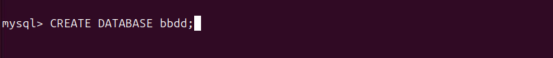

# Isard VDI
Para comenzar la instalación utilizaremos una maquina virtual llamada Isard VDI.

Primero buscamos el sitio web en internet o en nuestro navegador.

Entramos en el link marcado.

Iniciamos sesión con nuestro Usuario y contraseña 

Creamos un escritorio nuevo.

Seleccionamos el Ubuntu desktop y ponemos nombre a nuestro escritorio.

Al tener nuestro escritorio creado, entramos en los 3 puntos que salen para configurar el escritorio. 

Y desde este panel añadimos: CPUS, memoria y dejamos los videos tal y como estan.

# Owncloud

1. Actualización de la máquina
   

3. Instalación del servidor web apache2
   

5. Instalación del servidor de bases de datos mysql-server
   

6. Instalación de algunas librerías de PHP, el lenguaje principal que utilizan las aplicaciones
   

7. Reiniciamos el servidor apache2
   

## Configuración de MySQL

Accedemos a la consola de MySQL

 

Creación de la base de datos

 

Creación de un usuario

 

Conceder privilegios al usuario

 

Salir de la base de datos

 

Probar la conexión a la base de datos

 

 

