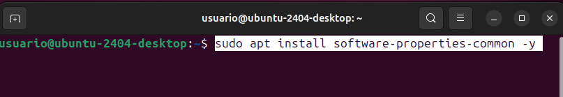
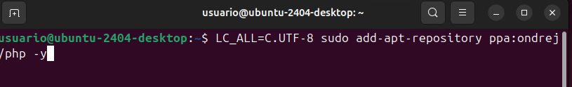
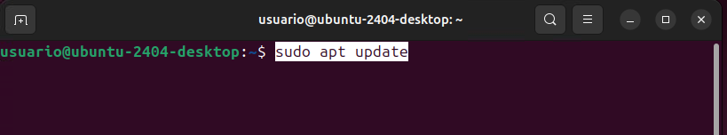

# Isard VDI
Para comenzar la instalación utilizaremos una maquina virtual llamada Isard VDI.

Primero buscamos el sitio web en internet o en nuestro navegador.

Entramos en el link marcado.

Iniciamos sesión con nuestro Usuario y contraseña 

Creamos un escritorio nuevo.

Seleccionamos el Ubuntu desktop y ponemos nombre a nuestro escritorio.

Al tener nuestro escritorio creado, entramos en los 3 puntos que salen para configurar el escritorio. 

Y desde este panel añadimos: CPUS, memoria y dejamos los videos tal y como estan.

# Owncloud

1. Actualización de la máquina
   

3. Instalación del servidor web apache2
   

5. Instalación del servidor de bases de datos mysql-server
   

6. Instalación de algunas librerías de PHP, el lenguaje principal que utilizan las aplicaciones
   

7. Reiniciamos el servidor apache2
   

## Configuración de MySQL

Accedemos a la consola de MySQL

 

Creación de la base de datos

 

Creación de un usuario

 

Conceder privilegios al usuario

 

Salir de la base de datos

 

Probar la conexión a la base de datos

 

 

# Descargamos los archivos de la aplicación web
En este punto deberemos descargar el archivo donde esta la cloud: https://download.owncloud.com/server/stable/owncloud-complete-20240724.zip 

Después de descargar seguimos estos pasos.

- Vamos al directorio /var/www/html.
  

- Copiamos la carpeta descargas y el archivo descargado en /var/www/html y descomprimimos el archivo.

  

  

- Eliminamos la carpeta creada al descomprimir

  

- Eliminamos el archivo index.html por defecto de Apache2

  

# Aplicamos permisos a nuestra aplicación web

Accedemos al navegador para comprobar que todo funciona

Introduce la dirección http://localhost en tu navegador web y continúa con la configuración de la aplicación

En este momento nos daremos cuenta que debemos cambiar la version de PHP si estamos en una mas avanzada de la que permite owncloud.

Instalar los requisitos previos para PPA

Instalar las herrmaientas necesarias

Actualizar los repositorios del sistema

Instalar librerias PHP 7.4

Seleccionar version de PHP

Activa los modulos de apache2

Reinicia el apache

Para iniciar sesión ponemos estos datos:

Usuario: usuario
Contraseña: password
Base de datos: bbdd
Dominio: localhost

